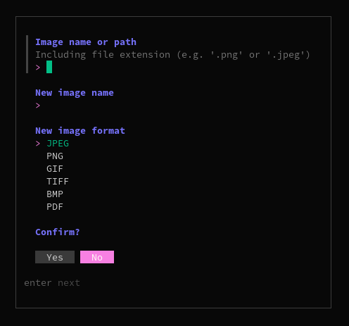

    
    <h2 align="center"></h2>
    

        <a href="https://github.com/smnprn/pixelize/issues">Report a bug</a>
        -
        <a href="https://github.com/smnprn/pixelize/issues">Request feature</a>
    

<!-- TABLE OF CONTENTS -->

<!-- About -->
## About the project

 

Pixelize is an app that lets you convert and resize images from the command line.  
<b> Currently supported formats: </b>
- JPEG
- PNG
- GIF
- TIFF
- BMP
- PDF
- HEIC

HEIC is supported only as a source file format.

### Built with
![GO][go-logo]  
![BUBBLETEA][bubbletea-logo]  

(<a href="#readme-top">back to top</a>)

<!-- How to install -->
## Installation
### Script
1. Download the latest release from the [GitHub Releases page](https://github.com/smnprn/pixelize/releases).
2. Extract the tarball (`tar -xzvf pixelize-linux-amd64.tar.gz`).
3. Make the installer executable (`chmod +x install.sh`).
4. Execute the installer (`./install.sh`).
5. Start the program (`pixelize`).

(<a href="#readme-top">back to top</a>)

<!-- Contributing -->
## Contributing
If you wish to contribute to the project <b>feel free to fork the repo and create a pull request</b>!\
You can report a bug opening an "issue" here on GitHub.
Any contribution you make is greatly appreciated.\
<b>Thank you!</b>

1. Fork the Project
2. Create your Feature Branch (`git checkout -b feature/YourFeature`)
3. Commit your Changes (`git commit -m 'add: added feature'`)
4. Push to the Branch (`git push origin feature/YourFeature`)
5. Open a Pull Request

(<a href="#readme-top">back to top</a>)

<!-- License -->
## License

Distributed under the MIT License. See `LICENSE.txt` for more information.

(<a href="#readme-top">back to top</a>)

<!-- CONTACT -->
## Contact

Simone Perna - simoneperna8@gmail.com

If you wish, feel free to write me a message on GitHub!

(<a href="#readme-top">back to top</a>)

[go-logo]: https://img.shields.io/badge/GO-67D6E1?style=for-the-badge&logo=go&logoColor=white
[bubbletea-logo]: https://img.shields.io/badge/Bubbletea-FF6DFF?style=for-the-badge&logoColor=white
